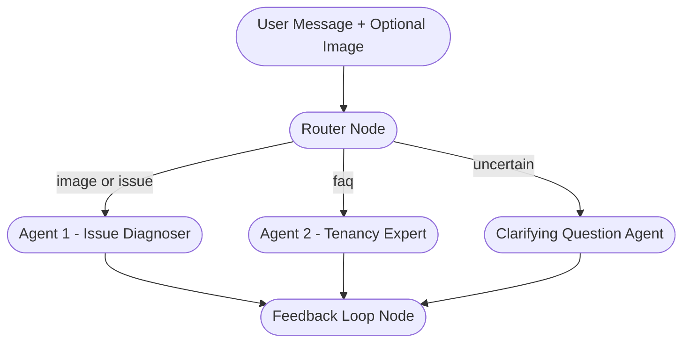

# 🏠 Real Estate AI Chatbot

An AI-powered multi-agent chatbot for real estate, capable of handling:
1. **Tenancy FAQs** (text-based questions)
2. **Issue Detection & Troubleshooting** (image + text inputs)

Built with **FastAPI** (backend) and **Streamlit** (frontend), deployed for free using **Render** and **Streamlit Cloud**.

---

## Features
- **Two AI Agents:**
  - **Agent 1:** Issue Detection & Troubleshooting (supports image + text input)
  - **Agent 2:** Tenancy FAQs (text input only)
- **Automatic Query Routing** between agents
- **Chat Bubble UI**
- **Image Upload Support**
- **Supports Enter Key to Send Messages**
- **Minimalist UI**

---

## Tech Stack
- **Backend:** FastAPI (Python 3.9.6), OpenAI GPT API
- **Frontend:** Streamlit
- **Deployment:**  
  - Backend → [Render](https://render.com/)  
  - Frontend → [Streamlit Cloud](https://streamlit.io/cloud)

---

## Deployment Links
- **Backend:** [https://<your-backend>.onrender.com](https://<your-backend>.onrender.com)
- **Frontend:** [https://<your-app>.streamlit.app](https://fatakpay.streamlit.app)

---

## How to Use
1. Open the **Frontend URL** in your browser.
2. Type your message in the input box.
3. Press **Enter** or click **Send**.
4. *(Optional)* Upload an image before sending.
5. Wait for the AI to respond in a chat bubble format.

---

## Local Setup

### 1. Clone the Repository
```bash
git clone https://github.com/Shaileshsachan/realestatebot.git
cd realestatebot
```

### 2. Backend (FastAPI)
```bash
cd backend
pip install -r requirements.txt
uvicorn app.main:app --reload
```

### 3. Frontend (Streamlit)
```bash
cd frontend
pip install -r requirements.txt
streamlit run st2.py
```

---

## Deployment Steps

### Backend on Render
1. Go to [Render](https://render.com/) → **New +** → **Web Service** → Connect your repo.
2. **Build Command:**  
   ```bash
   pip install -r requirements.txt
   ```
3. **Start Command:**  
   ```bash
   uvicorn app.main:app --host 0.0.0.0 --port $PORT
   ```
4. Add Environment Variables:
   ```
   OPENAI_API_KEY=your_openai_api_key
   ```
5. **Deploy** and copy your backend URL.

### Frontend on Streamlit Cloud
1. Go to [Streamlit Cloud](https://streamlit.io/cloud).
2. Deploy your frontend repo.
3. In **Secrets**, add:
   ```
   BACKEND_URL="https://<your-backend>.onrender.com"
   OPENAI_API_KEY="your_openai_api_key"
   ```
4. Deploy and copy the frontend URL.

---

## Demo Video
Will be done by EOD

---



## Screenshot
Here’s how the chatbot looks in action:


