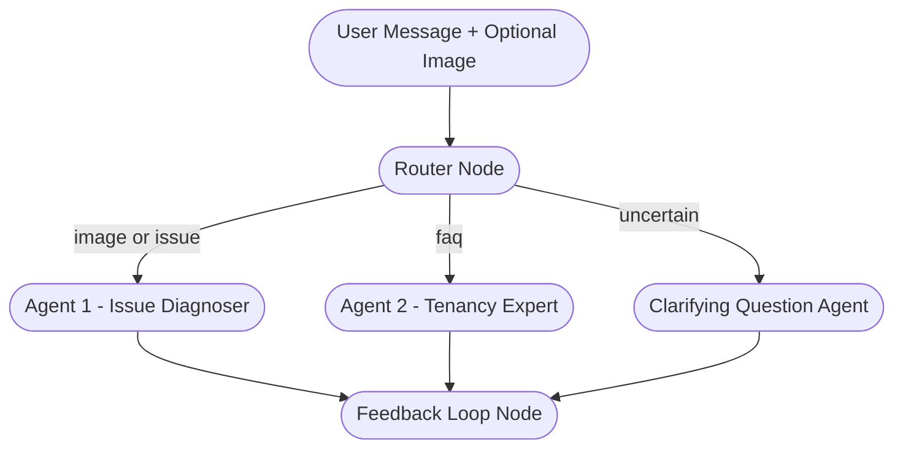

```mermaid
graph TD
    input([User Message + Optional Image])
    router([Router Node])
    agent1([Agent 1 - Issue Diagnoser])
    agent2([Agent 2 - Tenancy Expert])
    fallback([Clarifying Question Agent])
    feedback([Feedback Loop Node])

    input --> router
    router -->|image or issue| agent1
    router -->|faq| agent2
    router -->|uncertain| fallback
    agent1 --> feedback
    agent2 --> feedback
    fallback --> feedback
```